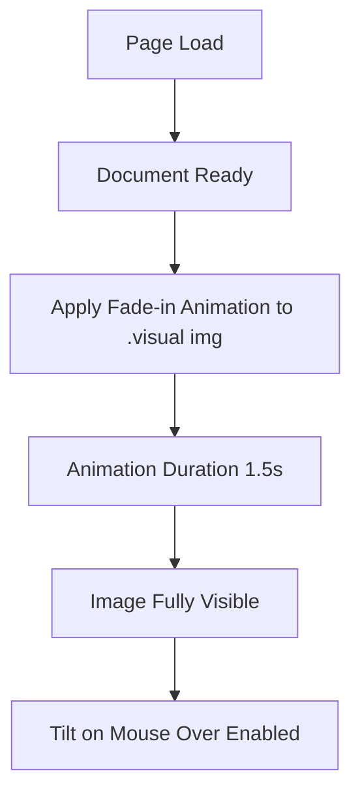

# Design Plan for Vispo Blackbox Site Improvements

## Overview
The current site is a minimal black-themed single-page application for the Vispo product, focusing on electronic warfare. Key elements include a two-column grid hero with slogan, domains, and the main black box image, a video carousel for use cases, sticky header, and footer. This plan outlines improvements to typography, spacing, colors, and the addition of a fade-in animation for the main image.

## Current State Analysis
- **Structure**: HTML5 semantic markup with hero, deck, header, footer.
- **Styling**: CSS with CSS Grid for layout, radial gradient mask on image, pure black background (#000), soft white text (#f5f6f7), muted gray (#b3b6bc).
- **Behavior**: JavaScript for 3D tilt on image, video autoplay/pause based on visibility.
- **Note**: JS references `tiltWrap` and `productImg` IDs not present in HTML; will need alignment.

## Proposed Improvements

### 1. Typography Enhancements
- Standardize font weights: Use 400 for body, 600 for headings, 700-800 for emphasis to improve hierarchy.
- Refine slogan sizing: Extend clamp range for better scalability (e.g., from 1.6rem to 4rem on larger screens).
- Add letter-spacing adjustments for better readability (e.g., 0.02em on main text).
- Ensure consistent line-heights (1.5 for body, 1.2 for headings).

### 2. Spacing and Layout Refinements
- Increase hero padding on larger screens using clamp (2rem to 6rem).
- Add consistent gaps between sections (e.g., 3rem between hero and deck).
- Refine grid gaps in hero: Increase to 2rem for better balance.
- Improve carousel spacing: Reduce gap to 0.4rem for tighter feel, adjust max-width to 1400px.
- Ensure mobile responsiveness: Enhance spacing on small screens.

### 3. Color Palette Improvements
- Introduce subtle accent color: Add a dark blue-gray (#1a1a2e) for hover states and footer border.
- Enhance muted color: Adjust to #a1a3a8 for better contrast.
- Keep core colors minimal but add depth with slight variations.

### 4. Fade-in Animation for Main Black Box Image
- Add CSS keyframes for fade-in: From opacity 0 to 1, with transform scale from 0.95 to 1 for subtle entry.
- Duration: 1.5s ease-out for smooth feel.
- Trigger on page load using CSS animation.
- Ensure compatibility: Use will-change for performance.

## Implementation Steps
1. Update HTML: Add IDs to image elements for JS compatibility (`tiltWrap`, `productImg`).
2. Modify styles.css:
   - Add animation class to .visual img.
   - Update color variables in :root.
   - Adjust typography rules (font-size, weight, spacing).
   - Refine spacing properties (padding, margins).
3. Enhance app.js: Ensure tilt functionality attaches correctly post-ID addition.
4. Test animations: Verify fade-in on load, no conflicts with tilt.
5. Optimize performance: Add preload for image if needed.

## Diagram: Animation Flow

This flowchart illustrates the sequence for the new image animation integration.

## Next Steps
- Implement changes in Code mode.
- Test across devices and browsers.
- Gather feedback for refinements.